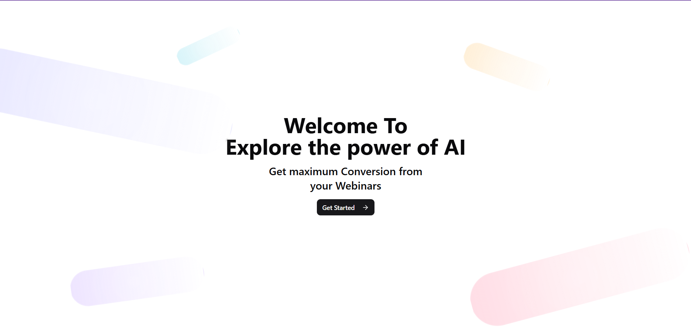
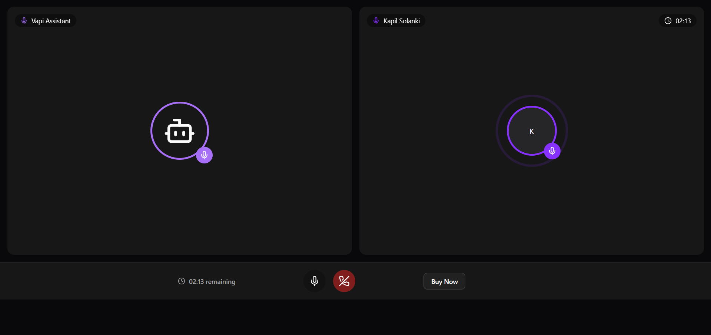
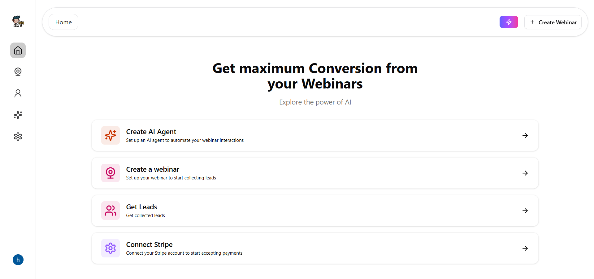
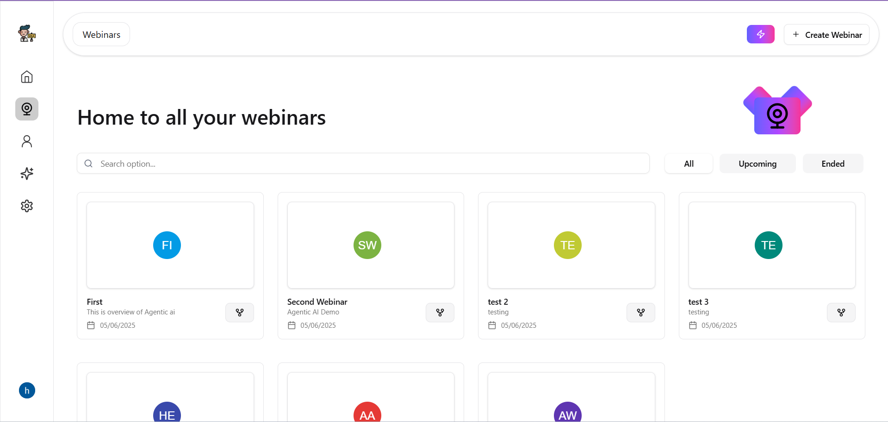

# Webinar AI - Boost Conversions with AI Agents

Welcome to **Webinar AI**, an AI-powered platform that helps you create, manage, and automate webinars — designed to maximize lead generation and conversion using intelligent agents.



## 🚀 Features

- 🔗 **Create AI Agents**  
  Set up conversational AI agents to assist during webinars or automate customer queries.

- 🎥 **Webinar Hosting Interface**  
  Host and manage live webinars with attendee engagement features.

- 🧠 **AI Automation**  
  AI agents interact with participants, answer FAQs, and collect qualified leads.

- 📅 **Schedule Webinars**  
  Organize upcoming webinars with intuitive controls and filters (All | Upcoming | Ended).

- 🧲 **Lead Generation**  
  Capture, store, and export leads gathered through webinar participation.

- 💰 **Stripe Integration**  
  Easily connect your Stripe account and start accepting payments for premium webinars.

---

## 📸 Screenshots

### 🔮 AI Agent Setup



### 🏠 Home Page



### 📅 Webinar Dashboard



---

## 🛠️ Tech Stack

- **Frontend**: Next.js + TailwindCSS
- **Backend**: Node.js, Express (API routes inside Next.js)
- **Database**: MongoDB / Prisma (if used, confirm in repo)
- **Authentication**: Clerk
- **Payments**: Stripe
- **Deployment**: Render / Vercel
- **AI APIs**: OpenAI, LangChain (if used for agents)

---

## 📦 Installation

```bash
git clone https://github.com/Hitesh-s0lanki/ai-sales-agent.git
cd ai-sales-agent
npm install
npm run dev
```
